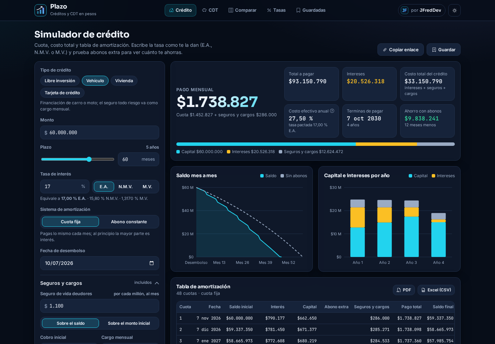
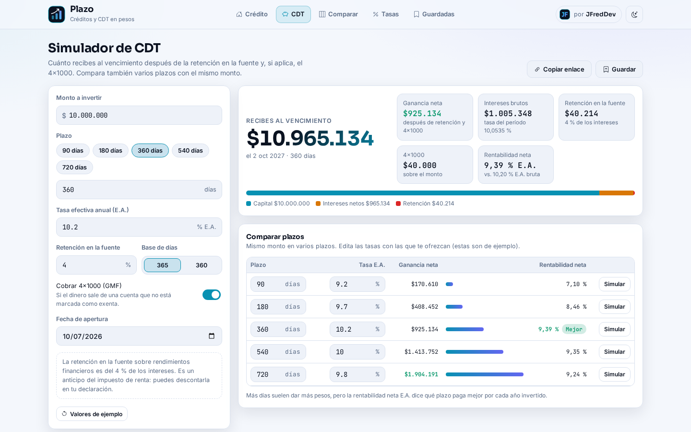
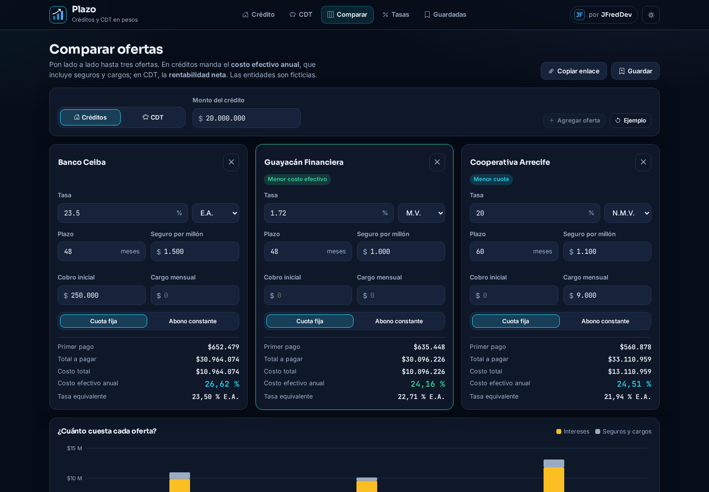
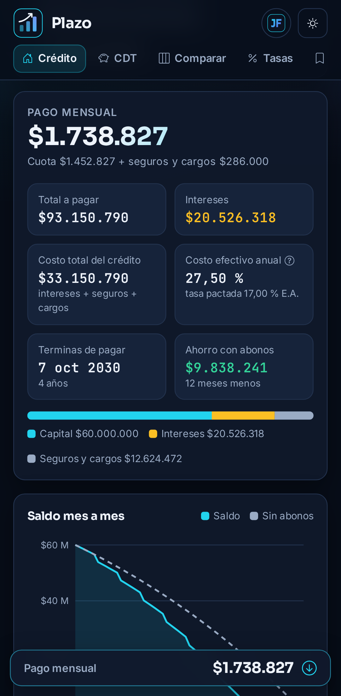
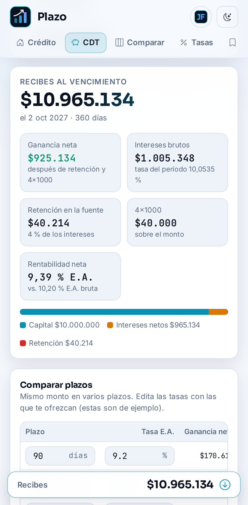
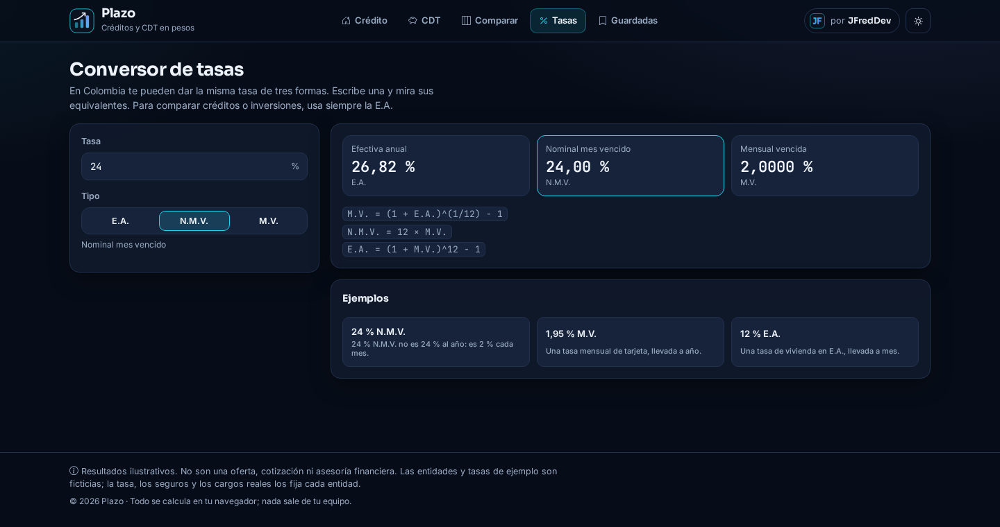

<p align="center">
  
</p>

<h1 align="center">Plazo</h1>

<p align="center">
  <b>Simulador de créditos y CDT en pesos colombianos.</b><br />
  Cuota, tabla de amortización, abonos extra, costo efectivo, retención en la fuente y 4×1000.
</p>

<p align="center">
  <a href="https://jfredmc.github.io/plazo/"><b>Ver la demo</b></a> ·
  <a href="#cómo-calcula">Cómo calcula</a> ·
  <a href="#desarrollo">Desarrollo</a>
</p>

<p align="center">
  <a href="https://github.com/JFredMC/plazo/actions/workflows/ci.yml"></a>
  <a href="https://github.com/JFredMC/plazo/actions/workflows/e2e-live.yml"></a>
</p>



> **Resultados ilustrativos.** Plazo no es una oferta, cotización ni asesoría financiera. Las entidades
> y tasas de ejemplo son ficticias; la tasa, los seguros y los cargos reales los fija cada entidad.

## Qué hace

**Crédito**

- Libre inversión, vehículo, vivienda y tarjeta de crédito, con valores de ejemplo para cada uno.
- Sistema francés (cuota fija) o abono constante a capital (como en la tarjeta).
- Tasa en **E.A., N.M.V. o M.V.**: al cambiar el tipo, el valor se convierte para que el crédito siga siendo el mismo.
- Seguro de vida deudores por millón (sobre saldo o monto inicial), cobro inicial y cargo mensual.
- **Costo total** y **costo efectivo anual**: la TIR de lo que recibes frente a todo lo que pagas.
- **Abonos extraordinarios** que reducen el plazo o la cuota, con el ahorro frente al plan sin abonos. Hay un atajo para abonar la prima cada 6 meses.
- Tabla de amortización completa, exportable a **PDF** y **CSV para Excel**.

**CDT**

- Plazo en días, tasa E.A., base 365 o 360.
- **Retención en la fuente** (4 % de los intereses, configurable) y **4×1000** opcional.
- Ganancia neta, valor al vencimiento, fecha de vencimiento y rentabilidad neta E.A.
- Tabla para comparar varios plazos con el mismo monto.

**Y además**

- **Comparador** de 2 o 3 ofertas de crédito (por costo efectivo) o de CDT (por rentabilidad neta).
- **Conversor de tasas** con las fórmulas a la vista.
- Gráficas del saldo mes a mes (con y sin abonos), capital e intereses por año y costo por oferta.
- **Enlace compartible**: la URL lleva todos los parámetros. **Simulaciones guardadas** en el navegador.
- Tema claro y oscuro, versión móvil con resumen fijo, formato colombiano (`$1.234.567`, `23,99 %`).

| CDT                                            | Comparador                                                |
| ---------------------------------------------- | --------------------------------------------------------- |
|  |  |

| Móvil                                                             | Móvil, tema claro                                      | Conversor de tasas                                |
| ----------------------------------------------------------------- | ------------------------------------------------------ | ------------------------------------------------- |
|  |  |  |

## Cómo calcula

Todo el cálculo vive en [`packages/finance-engine`](packages/finance-engine): TypeScript puro, sin dependencias y probado contra fórmulas y ejemplos hechos a mano.

| Concepto               | Fórmula                                                                                                     |
| ---------------------- | ----------------------------------------------------------------------------------------------------------- |
| Tasa mensual           | `M.V. = (1 + E.A.)^(1/12) − 1` · `N.M.V. = 12 × M.V.` · `E.A. = (1 + M.V.)^12 − 1`                          |
| Cuota fija             | `A = P · i / (1 − (1 + i)^−n)`, redondeada al peso                                                          |
| Redondeo               | El interés de cada mes se redondea al peso; la última cuota absorbe la diferencia y el saldo termina en $0  |
| Abono para bajar cuota | Se recalcula la cuota sobre el saldo y los meses que faltan                                                 |
| Costo efectivo         | TIR mensual de `monto − cobro inicial` contra cada pago (cuota + seguro + cargos), llevada a E.A.           |
| CDT                    | `intereses = monto · ((1 + E.A.)^(días/base) − 1)`; retención = 4 % de los intereses; 4×1000 sobre el monto |

Ejemplos que verifican las pruebas: $1.000.000 a 12 meses al 2 % M.V. da una cuota de **$94.560** y una última de **$94.555**; un CDT de $10.000.000 a 365 días al 12 % E.A. paga **$1.200.000** de intereses con **$48.000** de retención.

## Arquitectura

```
plazo/
├── packages/finance-engine   Motor financiero (tasas, amortización, TIR, CDT, comparador, CSV)
└── apps/web                  Angular 22: standalone, signals, zoneless, OnPush
    ├── core/                 Estado de cada pantalla ⇄ parámetros de URL, guardadas, exportación
    ├── shared/               Gráficas SVG propias, campo de pesos, diálogo, pipes
    └── features/             crédito · CDT · comparar · tasas · guardadas
```

- Sin backend: todo corre en el navegador y lo guardado queda en `localStorage`.
- Gráficas en SVG propio, sin librerías con licencia. jsPDF se carga solo al exportar.
- Desplegado en GitHub Pages con `base href` `/plazo/` y `404.html` para las rutas.

## Desarrollo

Requisitos: Node 22 y pnpm 10.

```bash
pnpm install
pnpm --filter @plazo/finance-engine build   # la app consume el motor compilado
pnpm --filter @plazo/web start               # http://localhost:4200

pnpm test        # motor (Vitest) + app (Vitest con Angular)
pnpm lint
pnpm typecheck

# E2E con Playwright contra el build de Pages (escritorio y móvil)
pnpm --filter @plazo/web build:pages
pnpm --filter @plazo/web e2e
# …o contra el sitio en vivo
E2E_BASE_URL=https://jfredmc.github.io/plazo/ pnpm --filter @plazo/web e2e
```

CI corre formato, lint, typecheck, pruebas, build y la suite E2E en cada PR. Después de cada despliegue, la misma suite se repite contra el sitio publicado.

## Licencia

MIT © Jhon Maquilon · [JFredDev](https://jfredmc.github.io/portfolio/)
